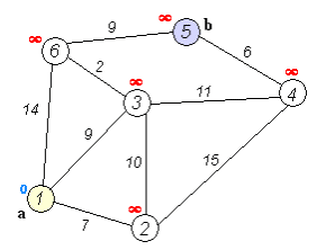
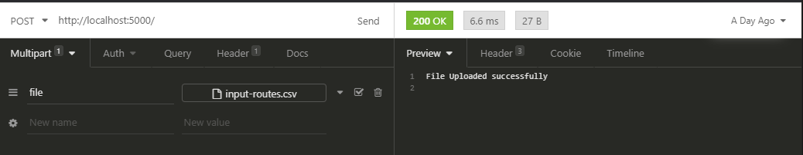
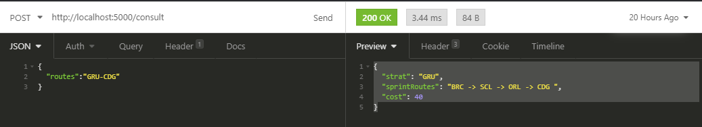
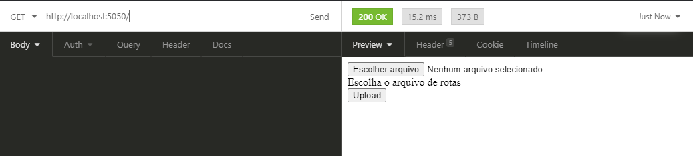
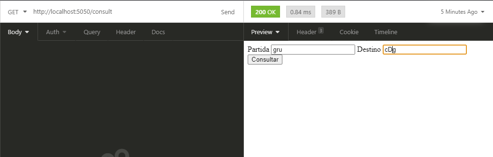
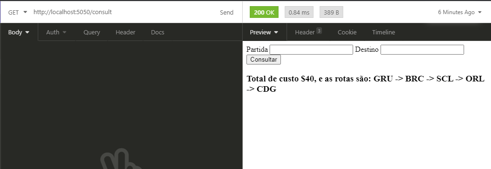
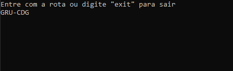
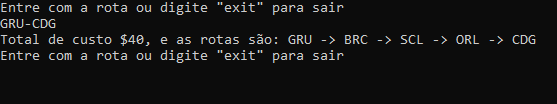

# Explicação do Desafio #
## Rota de Viagem ##

Um turista deseja viajar pelo mundo pagando o menor preço possí­vel independentemente do número de coneções necessárias.
Vamos construir um programa que facilite ao nosso turista, escolher a melhor rota para sua viagem.

Para isso precisamos inserir as rotas através de um arquivo de entrada.

## Input Example ##
```csv
GRU,BRC,10
BRC,SCL,5
GRU,CDG,75
GRU,SCL,20
GRU,ORL,56
ORL,CDG,5
SCL,ORL,20
```

## Explicando ## 
Caso desejemos viajar de **GRU** para **CDG** existem as seguintes rotas:

1. GRU - BRC - SCL - ORL - CDG ao custo de **$40**
2. GRU - ORL - CGD ao custo de **$64**
3. GRU - CDG ao custo de **$75**
4. GRU - SCL - ORL - CDG ao custo de **$45**

O melhor preço é da rota **1** logo, o output da consulta deve ser **GRU - BRC - SCL - ORL - CDG**.

### Execução do programa ###
A inicializacao do teste se dará por linha de comando onde o primeiro argumento é o arquivo com a lista de rotas inicial.

```shell
$ mysolution input-routes.csv
```

Duas interfaces de consulta devem ser implementadas:
- Interface de console deverá receber um input com a rota no formato "DE-PARA" e imprimir a melhor rota e seu respectivo valor.
  Exemplo:
  ```shell
  please enter the route: GRU-CGD
  best route: GRU - BRC - SCL - ORL - CDG > $40
  please enter the route: BRC-CDG
  best route: BRC - ORL > $30
  ```

- Interface Rest
    A interface Rest deverá suportar:
    - Registro de novas rotas. Essas novas rotas devem ser persistidas no arquivo csv utilizado como input(input-routes.csv),
    - Consulta de melhor rota entre dois pontos.

Também será necessária a implementação de 2 endpoints Rest, um para registro de rotas e outro para consula de melhor rota.

# Descrição #
A melhor maneira encontrada para solucionar o desafio foi utilizar o  [Algoritimo de Dijkstra](https://pt.wikipedia.org/wiki/Algoritmo_de_Dijkstra), baseado na teoria de grafos esse algoritimo calcula a menor distância passando pelos nós até o nó final.
 

Apartir disso separei o programa em quatro áreas.

1. Primeira é responsalvel por criar todo o algoritimo de Dijkstra e as funções de salvamento do arquivo csv, que serão utilizados nas demais partes.
2. Api Rest vai implementar o salvamendo do csv no endpoint ":5000/" e a parte do algoritimo onde irá retornar a rota mais barata sempre que fizer um request no endpoint ":5000/consult"
3. Logo depois teremos a interface web onde será visto a aplicação através de um navegador aonde será feita a consulta e também passar o arquivo para ser salvado.
4. Por ultimo a interface shell aonde será passado o arquivo csv através de uma tag e depois ocorrerá as consultas.

A estrutura do projeto foi feita com base nos pricipios propostos pelo [golang-standards/project-layout](https://github.com/golang-standards/project-layout) com pequenas modificações.

```
MelhorDestino
  |__cmd //Todas as main do projeto ficam nesse pacote
  |   |__apirest
  |   |__interfaceshell
  |   |__interfaceweb
  |
  |__csv //Arquivos csv
  |
  |__images //Imagens utilizada no README.md
  |
  |__internal     //Códigos de biblioteca que não podem ser usados por
  |   |           //aplicativos externos
  |   |
  |   |__apirest    //Faz a lógica do api rest
  |   |__dijkstra   //Contém a lógica do Algoritimo de Dijkstra
  |   |__utilites   //Contém algumas funções comum em todo o projeto
  |   |__web        //Faz a lógica de exibição da interface web
  |       |__templates //htmls utilizados para montar as pag. web
```

# Como Usar #

Para usar eu sugiro abrir um cmd/terminal/shell etc... para cada uma das aplicações.

A interface web depende de fazer chamadas http para a API, caso a api não esteja em funcionamento a interface web não realizará o salvamento nem a consulta das rotas, já a interface shell é independente não sendo necessário a API estar em funcionamento.

Em ordem sequencial:

Precisa ter o go instalado caso não tenha acesse o [link](https://golang.org/dl/) para obter.

Execute a [API](##-API-REST-##);

Execute a [interface web](##-INTERFACE-WEB-##);

Execute a [interface shell](##-INTERFACE-SHELL-##).


## API REST ##
Para rodar a api siga para o diretório `MelhorDestino/cmd/apirest` após isso execute o comando:

```shell
go build
```

Após compilar execute o programa, no caso do windows será:

```shell
apirest.exe
```

Para fazer o salvamento do csv a API responde no endpoint

```
http://localhost:5000/
```

Será nessesário criar uma chamada POST passando multipart/form-data com o nome "file" e o valor com o arquivo a ser salvo

Essa parte é para caso não queira usar o programa e queira fazer uma chamada http a parte. (Program utilizado na imagem é o Insomnia)

Para fazer as consultas a API responde no endpoint
```
http://localhost:5000/consult
```
Método POST Utilizando um json:
```json
{
  "routes":"GRU-CDG"
}
```

Var         | Type
:-------    | :---------: 
routes      | string

A resposta da chamda retorna um json:
```json
{
  "start":"GRU",
  "sprintRoutes":"BRC -> SCL -> ORL -> CDG",
  "cost": 40
}
```
Var           | Type
:-------      | :---------: 
start         | string
sprintRoutes  | string
cost          | int



## INTERFACE WEB ##
Para rodar a interface web siga para o diretório `MelhorDestino/cmd/interfaceweb` após isso execute o comando:

```shell
go build
```

Após compilar execute o programa, no caso do windows será:

```shell
interfaceweb.exe
```
Acesse o navegador para iniciar a interface web.

```
http://localhost:5050/
```

Essa primeiro url vai ser passado o arquivo de importação



<br>
<br>

Depois de salvar o arquivo será redirecionado para a aba de consulta.

```
http://localhost:5050/consult
```



<br>
<br>

Após digitar os valores de consulta é apresentado em tela o melhor caminha com o custo total.
<


## INTERFACE SHELL ##
Para rodar a interface shell siga para o diretório `MelhorDestino/cmd/interfaceshell` após isso execute o comando:

```shell
go build
```

Após compilar execute o programa, no caso do windows será:

```shell
interfaceshell.exe  arquivo_de_consulta.csv
```
Lembando que o arquivo deve estar no pacote csv dentro do projeto ou faça uma chamada http da api para salvar o arquivo.

Após executar irá abrir a  parte de escrita onde deve ser consultado usando o padrão de:
```
partida-destino
```


A resposta se dará nesse formato

